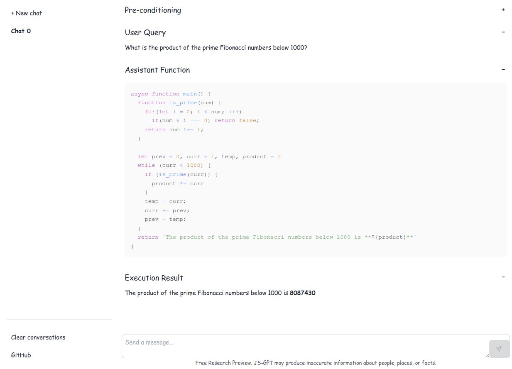

# js-GPT

<https://u8sand.github.io/js-gpt>

GPT--but answers are coded in Javascript and executed. This helps GPT overcome limitations like getting information about *today*, from external places via API, and provide more reliable calculations.

NOTE: This is a client-side application, all communication happens with OpenAI, all persistent state is stored in localStorage, all execution happens in your browser. **HOWEVER**, information is sent to OpenAI so care should still be taken with sensitive information or credentials.

## Examples

### How many years until 32-bit unix timestamps become a problem?

### How many fibonacci numbers are prime below 1000?

### How many stars on GitHub?
In the future, we might have ways to collect API tokens so that these features are quicker to use.

